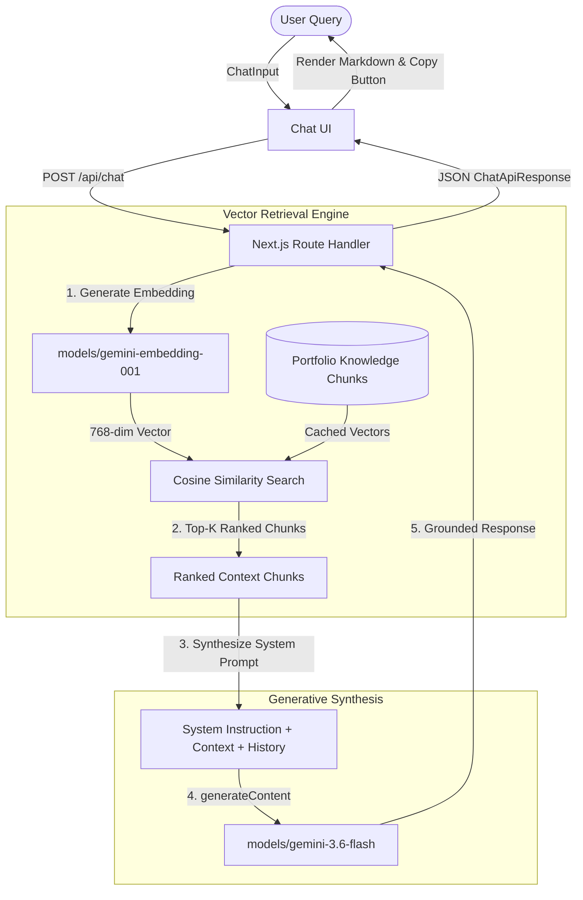

# AI Portfolio Chatbot System Documentation (Active RAG + Gemini)

> **Author**: Muhammad Zohaib  
> **Framework**: Next.js (App Router) & React 19  
> **Language**: TypeScript  
> **AI Foundation**: Google Gemini API (`gemini-3.6-flash` / `gemini-3.8-flash`)  
> **Vector Embeddings**: Google Gemini Embeddings (`gemini-embedding-001`)  
> **Styling**: Tailwind CSS v4 & shadcn/ui-inspired primitives  
> **Icons**: Lucide React  

---

## 1. System Overview & Active RAG Architecture

The AI Portfolio Assistant uses a **real-time Retrieval-Augmented Generation (RAG)** architecture. When a visitor asks a question, the system semantically searches Muhammad Zohaib's verified portfolio knowledge base, retrieves the most relevant context chunks, and synthesizes a grounded response via the Google Gemini API.



---

## 2. Directory Structure

```
my-info/
├── .env.local                       # Google Gemini API key & model settings
├── app/
│   ├── api/
│   │   └── chat/
│   │       └── route.ts             # Active RAG POST endpoint
│   ├── globals.css                  # Modern Tailwind CSS styling & custom scrollbars
│   ├── layout.tsx                   # Root HTML layout with Geist typography & SEO metadata
│   └── page.tsx                     # Portfolio page hosting the AI assistant
│
├── components/
│   ├── chat/
│   │   ├── chat-container.tsx       # Main chat orchestrator (auto-scrolling, layout)
│   │   ├── chat-header.tsx          # Identity, pulsing status badge, reset action
│   │   ├── chat-message.tsx         # User & assistant bubbles, markdown, copy feedback
│   │   ├── chat-input.tsx           # Auto-resizing textarea, Enter/Shift+Enter, send button
│   │   ├── chat-welcome.tsx         # Greeting card with interactive suggestions
│   │   ├── chat-suggestions.tsx     # 4 quick-prompt question chips
│   │   └── typing-indicator.tsx     # Animated three-dot bouncing indicator
│   └── ui/
│       ├── avatar.tsx               # Avatar container with fallback
│       ├── badge.tsx                # Status badges
│       └── button.tsx               # Reusable button with CVA variants
│
├── hooks/
│   └── use-chat.ts                  # React hook for message history & lifecycle
│
├── lib/
│   ├── rag/
│   │   ├── portfolio-knowledge.ts   # Structured portfolio knowledge documents
│   │   ├── vector-store.ts          # In-memory vector store & cosine similarity search
│   │   └── gemini-client.ts         # Gemini prompt synthesis and API caller
│   ├── mock-data.ts                 # Fallback offline knowledge base
│   └── utils.ts                     # Class name merging utility (clsx + tailwind-merge)
│
├── types/
│   └── chat.ts                      # TypeScript models for Message and API
│
└── CHATBOT_DOCUMENTATION.md         # This technical documentation
```

---

## 3. RAG Pipeline Implementation Details

### Step 1: Knowledge Documents (`lib/rag/portfolio-knowledge.ts`)
The portfolio information is split into distinct semantic passages covering:
1. **Bio & Background**: Professional summary, engineering philosophy, and passions.
2. **Core Skills**: Full-stack web, generative AI, microservices, cloud infrastructure, and DevOps.
3. **Frontend Stack**: Next.js App Router, React 19, TypeScript, Tailwind CSS, shadcn/ui.
4. **Backend & AI Stack**: Node.js, Python, FastAPI, Gemini API, LangChain, vector DBs.
5. **Services Offered**: Full-stack apps, AI integration, API development, and code auditing.
6. **Project Case Studies**: Real examples with architectures, technologies, and features.
7. **Contact & Collaboration**: Availability, contract inquiry, and preferred communication.

### Step 2: Vector Embedding & Cosine Similarity (`lib/rag/vector-store.ts`)
- Calls `models/gemini-embedding-001:embedContent` via the Gemini REST API.
- Generates 768-dimensional float vectors.
- Knowledge base embeddings are calculated on startup and cached in memory for sub-millisecond similarity queries.
- When a user query arrives, its embedding is compared against all chunk vectors using **Cosine Similarity**:
  $$\text{Similarity}(A, B) = \frac{A \cdot B}{\|A\| \|B\|}$$
- Chunks are ranked in descending order, and the Top-3 are returned.

### Step 3: Grounded Gemini Prompting (`lib/rag/gemini-client.ts`)
- Injects the top context chunks into Gemini's `systemInstruction`.
- Instructions strictly enforce:
  - Answering accurately based on the verified portfolio data.
  - No hallucinations or fabricated projects/skills.
  - Professional, warm, engineering-savvy tone.
  - Markdown formatting with bolding, lists, and code blocks.
- Passes conversation history for contextual multi-turn conversation.
- Calls `models/gemini-3.6-flash:generateContent`.

---

## 4. API Route Specification (`POST /api/chat`)

### Request
```http
POST /api/chat
Content-Type: application/json

{
  "messages": [
    {
      "role": "user",
      "content": "What AI and backend technologies does Zohaib work with?"
    }
  ]
}
```

### Response
```json
{
  "success": true,
  "message": {
    "id": "msg_1789025810000_x9a2b",
    "role": "assistant",
    "content": "Zohaib works with a modern AI and backend stack:\n\n• **AI & LLM Models:** Google Gemini 3.6 Flash, Gemini Pro, OpenAI GPT models, Anthropic Claude\n• **AI Frameworks:** Google GenAI SDK, LangChain, LlamaIndex\n• **Vector Systems:** gemini-embedding-001, Pinecone, ChromaDB\n• **Backend Runtimes:** Node.js (v20+), Python 3.11+, Bun\n• **Frameworks & DBs:** FastAPI, Express, PostgreSQL, MongoDB, Redis",
    "createdAt": "2026-09-10T07:31:00.000Z"
  }
}
```

---

## 5. Security & Configuration

- **API Keys**: Stored in `.env.local` as `GEMINI_API_KEY`.
- **Git Security**: `.env*` is in `.gitignore`, preventing accidental commits of credentials.
- **Server Execution**: The API key is only accessed on the Next.js server runtime (`app/api/chat/route.ts` and `lib/rag/`) and is **never** sent or exposed to the client browser.
